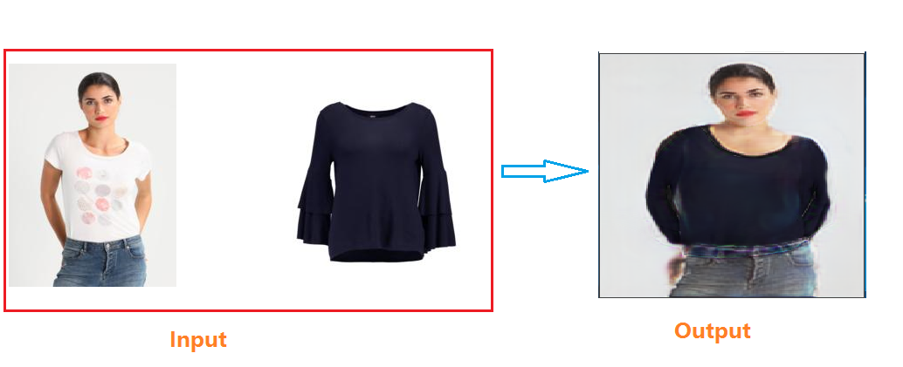

# virtual_try_on_use_deep_learning
>使用深度学习算法实现虚拟试衣，结合了人体姿态估计、人体分割、几何匹配和GAN，四种模型。
 
### 程序实现思路
>这套程序实现起来挺复杂的，因为它里面包含了4种深度学习模型，而且有一个自定义层CorrelationLayer，需要自己编程实现它。
然而我想使用onnxruntime作为推理引擎时，onnxruntime不支持自定义层的，这算是opencv的一个优势的。

### 模型文件下载与运行
本套程序仅仅只依赖opencv库就能运行，主程序文件是 main.py，模型文件从百度云盘下载地址如下： <br/>
链接：https://pan.baidu.com/s/13Eic0aiMtCGY7iigjg71DQ <br/>
提取码：xsl5

> 这套程序只有Python版本的，我在本地编写了C++程序，但是输出结果跟Python版本的输出结果始终不一致，
对于这个bug我还没有找到原因，因此我在github只发布python程序的。程序启动运行之后，要等几秒种后才能弹窗显示结果，
程序运行速度慢的问题还有待优化。

 **注：以上为原作者的标注内容**

---
### 补充
自测下列环境可以成功运行
```txt
python==3.8.0
certifi==2021.10.8
numpy==1.22.1
opencv-python==4.5.1.48
wincertstore==0.2
```

### 执行过程
1. 克隆本项目到本地
```shell
git clone https://github.com/GerogeLiu/virtual_try_on_use_deep_learning.git
```
2. 项目根目录创建models目录，在百度云盘下载模型文件并将文件放置到models目录
3. anaconda下创建虚拟环境
```shell
# 创建虚拟环境
conda create -n <virtualName> python==3.8.0
```
4. 安装必要的第三方库
```shell
# 激活虚拟环境
conda activate <virtualName>

# 安装opencv
pip install opencv-python==4.5.1.48 -i https://pypi.douban.com/simple
```
5. 执行main.py
```shell
# 切换到本项目目录
cd you/path/to/virtal_try_on_use_deep_learning

# 执行
python main.py
```

### 运行效果图
